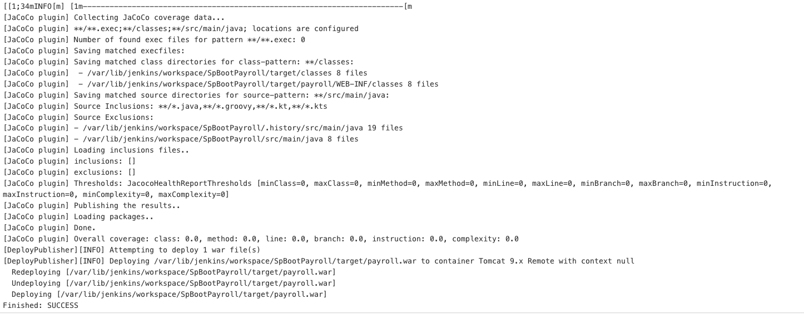
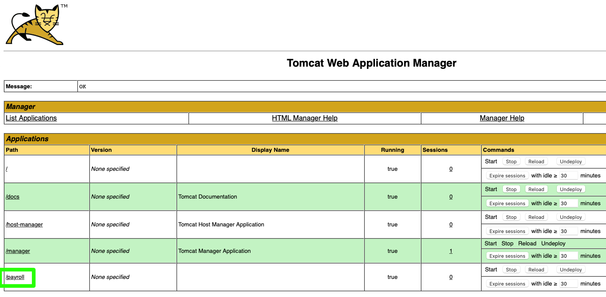
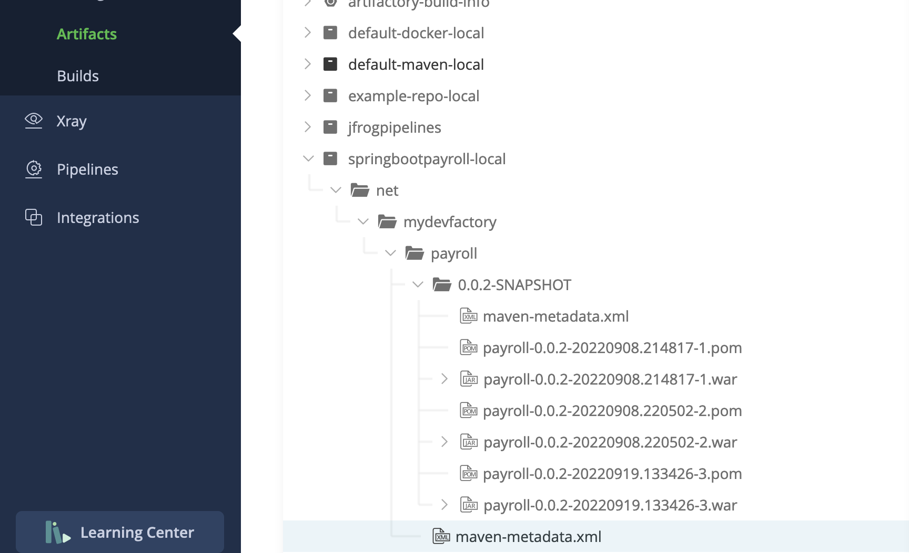

# Spring Boot Payroll app

## Purpose of this app

This application is not a payroll application but an API to get a list of employees for example. It can be used for other purposes.
Basically, you can make several requests to this API like:

- Listing all records
- Add a new record
- Update an existing record
- Delete a record

## Spring Boot

**What is Spring Boot?**

Spring Boot is a powerful framework to create Web applications or API. It work as a standalone app and it can use several components of the famous Spring Framework.

**Why Spring Boot?**

Historically, we worked on powerful servers with J2EE and then appeared "Spring" which is lighter than his old brother. Then, it became mandatory to separate the backend from the frontend to build more resilient and maintainable applications. Also, with the increasing popularity of Cloud services, "Spring Boot" appeared.
You can even have a local server that you can launch with the cli.

Spring Boot can compete with other frameworks like NodeJS or Symfony whereas Symfony can cover more needs than Spring Boot.
Therefore, the main purpose of Spring Boot is to build secured APIs that are receiving many requests from applications and for different purposes.

## How to use the Spring Boot Payroll app?

There are two ways to use this application. I recommend the use of Maven. You can also use Graddle but I'll show you how to use Maven.
If you do not have Maven installed on your system, you can read the [documentation][1].

**First:**

    mvn package

This command created a subdirectory "target" that contains a .jar file. Then, call the Java binary to run this .jar file.

    java -jar path/to/MyJarFile.jar

**Second:**

It can be quicker with this command:

    mvn clean spring-boot:run

Here is a screenshot of the starting process...

### How to display mnv update for dependencies?

    mvn versions:display-dependency-updates

Then, you can update to the latest version with:

    mvn versions:use-next-releases

### Requests to the API

You can make the following requests:

Get a list of records:

    curl -v localhost:8080/employees

Get a specific record id:

    curl -v localhost:8080/employees/3

Check the 404 status:

    curl -v localhost:8080/employees/99

Create a new record:

    curl -X POST localhost:8080/employees -H 'Content-type:application/json' -d '{"name": "Sam Fisher", "role": "Agent", "department": "Security"}'

Update an existing record:

    curl -X PUT localhost:8080/employees/3 -H 'Content-type:application/json' -d '{"name": "Daniel Fisher", "role": "Agent", "department": "Security"}'

Delete a record:

    curl -X DELETE localhost:8080/employees/4

[1]: https://maven.apache.org/install.html

## Use a different port

By default, a Spring Boot application is running on the 8080 port but you can override this by adding an application.properties file (windows .ini style) or an application.yml file in the root of your project. We can use the 8081 port instead.

    server.port=8081

## Build the application

You can build this application and send it to a Tomcat container.
To do so, you need to configure the deployer credentials to contact the Tomcat API. In order to check the webapp url on your Tomcat server, you can check the Jenkins logs, log in to your-tomcat-server-url/manager/html/ (Tomcat Web Application Manager UI) or ssh to the server and browse the /var/lib/tomcat9/webapps/ directory.

Build SUCCESS with Jenkins

Tomcat Web Application Manager

## JFrog build and artifact

The pipeline.yml describe two processes:

- the build process
- publish the artifact into a local repo

The first step is a kind of MvnBuild step. It performs a Maven build of files located in the GitHub repository. Look at the documentation: [MvnBuild](https://www.jfrog.com/confluence/display/JFROG/MvnBuild)

The second step is the [PublishBuildInfo](https://www.jfrog.com/confluence/display/JFROG/PublishBuildInfo). It publishes the build into JFrog Artifactory.

